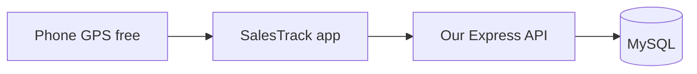
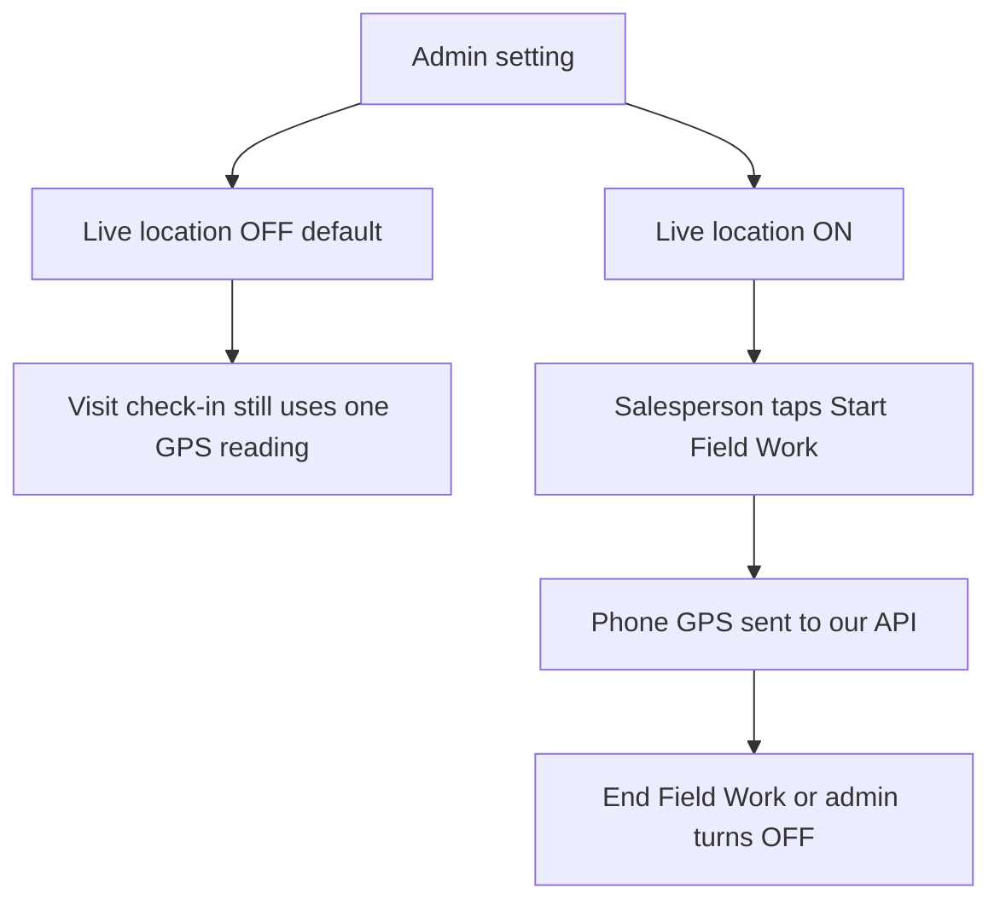
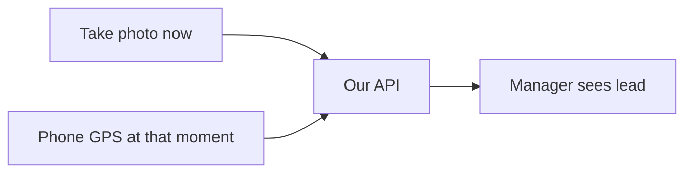
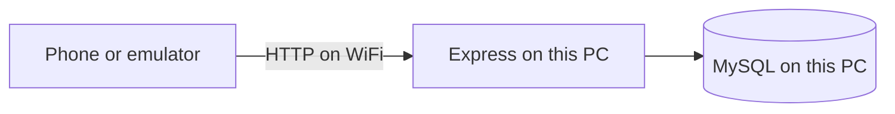

# SalesTrack — Saved Plan

Saved: 24 September 2026  
Status: approved for local build (Sprints 1–2 first). VPS later.  
UI: `design/mobile-ui-reference.jpg`  
Cursor copy: `.cursor/plans/salestrack_foundation_4469bdeb.plan.md`

SalesTrack helps a salesperson finish today’s beat and helps a manager see missed work. It is not an employee-tracking product and not an enterprise CRM.

**Build first: backend (Sprint 1), then Android UI on that backend (Sprint 2).** Admin website later, after the app creates real data.

## Expert pass — what changed and why

Reviewed as a 5-year field sales manager and as a fullstack developer. The old plan was a full SaaS suite. That is how products stall. This plan sells and ships.

**Added (high value, small build)**

- **Today’s beat** — Home is the next customer and the rest of today’s list, not a SAP-style dashboard. This is how Indian field teams actually work.
- **WhatsApp** next to Call (`wa.me`) — field use this more than CRM notes.
- **Visit place photo (camera now)** — salesperson shoots the shop/place at the visit. Saved with GPS + time. Manager opens the lead/visit and sees the pic + pin. That confirms the visit, even when live location is Off.
- **Excel lead import** for the manager — they already have lists in Excel. More useful than a live map.
- **Record sale = customer + amount + note** (optional bill photo). No product master in v1.
- **Optional collection amount on a visit** — many beats include outstanding pickup. Not a finance ledger.
- **Overdue follow-ups** as the #1 manager alert. Live map is not the #1 tool.
- **Local phone reminders** for follow-ups. No Firebase in v1.
- **Manager list polling** (30–60s) instead of Socket.IO.

**Removed or deferred (same job, less machinery)**

- **SUPER_ADMIN + SaaS admin** — keep `tenant_id` on tables (cheap). Do not build a platform console until company #2.
- **SUPERVISOR role** — three bosses for one team. Use ADMIN (owner), MANAGER (web), SALES_EXECUTIVE (app).
- **8 statuses on the phone** — backend can store the full path; the app shows New / Follow-up / Won / Lost. Salespeople will not maintain Negotiation vs Quotation.
- **Nested territories, assignment engine, website lead API** — manager assigns; Excel import covers bulk. Auto-assign later.
- **Product catalog, quotations, order line items** — Record sale does the same job until they have a real price list.
- **Attendance module** — Start/End Field Work is the field clock. Office punch-in is a different product.
- **Expenses** — WhatsApp + a spreadsheet until the core loop is live.
- **Socket.IO, Redis, FCM, MapLibre, anomaly engine, retention cron, notification preferences, audit-everything, Play Store** — not needed to run a 5–20 person team.
- **Customer contacts/addresses as extra tables** — one phone, one address, one GPS on the customer.
- **visit_notes / visit_locations tables** — notes, photo, check-in GPS live on the visit row.
- **3-page intro, Reports tab, empty `+` actions, reserved empty API modules, activity_logs in Sprint 1** — noise.
- **All-day GPS before visit check-in** — check-in proves the visit. Route tracking is manager context, built after visits.
- **Paid live-location APIs** — phone GPS + our API does the same job for ₹0.

**Kept (do not cut)**

- Session-based GPS (Start / End Field Work), never 24/7
- Server checks visit distance (do not trust the phone)
- Offline queue for field actions
- Duplicate phone warning
- Won lead converts to customer (no copy-paste duplicate)
- Device deactivate on lost phone
- Backend never trusts role, price, or “I was there”
- **All testing is local on this Windows PC** until you configure the VPS yourself later
- Phone + password; admin resets password (no SMS OTP yet)

## Locked decisions

- First implementation: **Sprints 1–2 only**
- API: Express + TypeScript + Prisma + MySQL
- App: Expo development build, Android only
- Repo: npm workspaces — `backend/`, `frontend/`, `mobile/`
- 3 roles: `ADMIN`, `MANAGER`, `SALES_EXECUTIVE`
- Currency INR, store UTC, show IST
- Login: phone + password + device id
- Multiple devices allowed; manager can deactivate one
- Hosting for now: API + MySQL on this Windows PC. Phone/emulator on the same Wi-Fi. VPS is out of scope until you say so. The APK never contains the backend.
- Maps: open Google Maps for Navigate; manager web map later via simple tiles + last point
- File uploads: local disk on the API (visit place photo, sale bill)
- **Visit proof = camera photo + check-in GPS + server time.** Manager reviews that on the lead/visit. Live location stream is extra and still default Off.
- **Location capture: phone GPS only. No paid live-location API** (no Google Fleet, HyperTrack, Radar). Our Express API stores points. Map tiles later = OpenStreetMap (free).
- **Live location is an admin switch, default OFF.** Phone GPS only. Not 24/7.
- **Mobile UI reference:** [`design/mobile-ui-reference.jpg`](design/mobile-ui-reference.jpg). Match look and screen layout; do not blindly build every mockup feature.

## Mobile UI reference (use this look)

Source image: salesperson phone screens 1–16, manager phone 17–18. Product name on login: **SalesTrack** (not “Sales Team Tracker”).

**Visual system (copy this)**

- White screens, lots of space, rounded cards, light gray borders, soft shadows
- Greeting + avatar top-left on Home
- **Green** pill buttons = Start / Save / Visit / success
- **Blue** = Login / Call
- **Red** = End Field Work
- Bottom nav icons + labels, active item in color
- Status chips (Hot / Warm, Delivered / Pending) as small colored pills
- Map screens: pin + distance, not a dense dashboard

**Bottom nav (match the mockup)**

Home / Leads / Visits / Reports / More

Reports for the salesperson is **My Performance**, not company-wide manager reports.

**How each mockup screen is used**

| # | Mockup | We build | Notes |
|---|---|---|---|
| 1 | Login | Sprint 2 | Phone + password. No public sign-up. “Contact admin.” |
| 2 | Home | Sprint 2 | Same cards. Empty/zero first. Field Work does not start GPS yet. |
| 3 | Start Field Work | Sprint 5 | Location permission copy. Live location still admin-gated. |
| 4 | Field Work Active | Sprint 5 | Stats + End (red). Stream only if admin opened live location. |
| 5 | Live location map | Sprint 5–6 | Today’s customers + last point. Hidden/disabled if live location Off. |
| 6 | Leads | Sprint 3 | Search, Call, Visit. Filters: New / Follow-up / Won. |
| 7 | Customer details | Sprint 3–4 | Call, Start Visit. Add Take place photo when visit starts. |
| 8 | Check-in | Sprint 4 | Distance + Start Visit after server GPS check. |
| 9 | Visit in progress | Sprint 4 | Outcomes. Add camera place photo (required for success). Record sale, not full product grid. |
| 10 | New order | Sprint 6 | Same layout, but Record sale (amount + note). |
| 11 | Follow-ups | Sprint 3 | Upcoming / completed. Call / WhatsApp. |
| 12 | Orders | Sprint 6 | List of sales. |
| 13 | Expenses | Not v1 | Same look if we add later. |
| 14 | My Performance | Sprint 7 | Reports tab. |
| 15 | Notifications | Later | Local follow-up reminders first. |
| 16 | Profile / More | Sprint 2 | Profile + logout. Hide Expenses/Attendance until those sprints. |
| 17–18 | Manager team / reports | Web first (Sprint 6–7) | Same map/cards if a manager ever uses the phone. |

**Copy:** use normal words with spaces (“Good morning”, “Field work”, “Start visit”).

**Do not copy from the mockup:** public “create account”, always-on live map, product line items, expenses as a first-class tab, Reports as company analytics on the phone.

## Tech stack (what we will actually install)

**Sprints 1–2 (first build — this PC)**

| Layer | Choice | Why |
|---|---|---|
| Language | TypeScript | Same language on API and app |
| API | Node.js + Express | You already know this style of API |
| Database | MySQL | Local, familiar, enough for this product |
| ORM / migrations | Prisma | Schema + seed without hand-written SQL dumps |
| Validation | Zod | One place for login/body checks |
| Auth | JWT access + refresh, bcrypt | Standard, no Auth0 bill |
| Repo | npm workspaces (`backend/`, `frontend/`, `mobile/`) | Simple on Windows, no pnpm extra |
| Sales app | React Native via Expo (dev build, not Expo Go) | Faster than bare Android; GPS service can be added later |
| App OS | Android only | Sales team phones |
| Tokens on phone | Expo SecureStore | Not plain AsyncStorage |
| API test | Postman or browser | `http://localhost:3000` |
| Phone → API | HTTP on same Wi-Fi | `10.0.2.2` emulator, LAN IP for a real phone |

**Later sprints (not installed on day one)**

| When | Stack |
|---|---|
| Sprint 4–5 GPS | `expo-location` + Android foreground service (phone GPS) |
| Sprint 4 + 6 files | Camera capture on phone; Multer (or similar) saves place photo on API disk |
| Sprint 6 manager web | React + Vite + TypeScript |
| Sprint 6 Excel import | `xlsx` (or SheetJS) on the API |
| Sprint 6 map | Leaflet + OpenStreetMap tiles |
| Sprint 8 offline | SQLite on the phone (Expo SQLite) + sync queue |
| Follow-up ping | Local notifications on the phone |
| VPS (only when you ask) | Nginx + Node via PM2 + MySQL + HTTPS |

**Will not use**

NestJS, Redis, Socket.IO, Firebase/FCM, MongoDB, PostgreSQL, paid Google Maps SDK, HyperTrack/Radar, Mapbox live, Auth0, Docker-as-a-must (optional later).

## Location: what is free vs what we do not buy

**Capturing live location does not need a Google/paid API.** The Android GPS chip already gives latitude, longitude, accuracy, speed. Expo Location reads that. The app posts it to **our** backend. That is the “live location API.”

| Need | What we use | Cost |
|---|---|---|
| Read salesperson GPS | Android / Expo Location | Free |
| Store / show last point and route | Our API + MySQL | Free |
| Manager map (later) | Leaflet + OpenStreetMap tiles | Free |
| Navigate to customer | Open Google Maps app (`geo:` / maps intent) | Free |
| Address → pin (optional later) | Type address, or Nominatim (fair use), or skip | Free |
| Visit check-in distance | Our server math (haversine vs customer lat/lng) | Free |

**Do not add:** Google Geolocation API, Google Maps “live tracking” / Fleet, HyperTrack, Radar, Mapbox paid live, TrackKit-as-a-service.

**Do not use Nominatim on every GPS ping.** Reverse-geocode only if we add “fill address from pin” later.

Google Maps in the phone is only a **button** (Navigate). We do not embed a billed Google Maps SDK in v1.

## Live location service (admin on/off, default closed)

This is **our** service (phone GPS → our API). Admin opens or closes it. Seed value: **closed**.

| Rule | Behavior |
|---|---|
| Default | `live_location_enabled = false` |
| Who can toggle | ADMIN only (`PATCH /settings/live-location`) |
| When OFF | No stream. No manager live map. Field Work is only a work clock. |
| When ON | Stream starts only after **Start Field Work**. Stops on **End Field Work**. |
| Sensor | Mobile GPS only |
| Secret tracking | Never. Phone shows a notification while streaming. |
| Admin turns OFF mid-day | API rejects new points. App stops GPS and tells the salesperson. |
| Admin turns ON | Does not spy immediately. Next Start Field Work (or current session) may begin streaming. |
| Visit check-in | Separate. One GPS read to verify the shop, even if live location is OFF. |
| Visit place photo | Required to complete a normal visit. Camera now + GPS + time. Manager uses this to confirm the lead/visit. |

Sprint 1 stores the flag and the admin API. The app reads it from `/auth/me` and shows **Live location: Off**. Streaming is built in Sprint 5. Manager map in Sprint 6 only draws points if the flag is on and `last_seen` is fresh.

## Visit place photo (manager confirmation)

This is how the manager knows the salesperson was really there. **Stronger than live location.** Live location can be Off and visits can still be confirmed.

**Salesperson (at the shop)**

1. Check Location (GPS vs customer pin).
2. Tap **Take place photo** — opens the **camera**, not the gallery.
3. Shoot the shop front / meeting place **now**.
4. App sends: image + lat/lng + accuracy + phone time. Server stores file and **received_at**.
5. Complete Visit (or mark lead Won). Photo stays on that visit/lead.

**Manager (web, Sprint 6)**

- Open the lead or visit.
- See: place photo, map pin (photo GPS + customer pin), time, distance, salesperson name.
- Mark **Visit confirmed** or leave a note if the pic looks wrong.
- If live location is On, they also see last stream point. Photo is still the proof of **this** stop.

**Rules**

- One place photo per visit in v1 (not a 10-pic album).
- Camera first. Gallery upload is off unless admin later allows it (easy to cheat with an old pic).
- Unavailable / customer not there: photo not required; they pick that outcome and set a follow-up. No fake “success” without a pic.
- Won / visit success: photo required.
- File on API disk. Not in MySQL. Compress on the phone before upload.
- Do not trust the phone clock alone. Show manager both captured and received time.

## Who uses what

- **SALES_EXECUTIVE (Android):** own beat, leads, customers, visits, follow-ups, record sale. Call / WhatsApp. Own numbers on Home.
- **MANAGER (Web, later):** team, assign, Excel import, overdue alerts, today’s activity, visit photo + pin to confirm the lead/visit, optional live map if admin opened it. Cannot change to “watch kilometres.”
- **ADMIN (Web, later):** users, settings (visit radius, tracking interval, working hours, live location toggle). Often the owner; can also be the manager in a small company.

## The day we are designing for

Morning: start field work → see **next stop** and today’s beat.

At each stop: Call or WhatsApp → Navigate → Check Location → Start Visit → talk → **Take place photo (camera now)** → Record sale and/or collection if any → next follow-up or mark lost → Complete Visit. Manager later opens that lead and sees the pic + pin.

Evening: missed stops are visible → End Field Work → short day summary (visits, sales, missed, overdue). Tomorrow’s beat can be planned then or by the manager.

Home must answer: **who is next, where, what to do, what is overdue.**

## Architecture (simple)

No Redis, no Socket.IO, no FCM, no microservices. Manager “live” view = last location + age, refresh every 30–60 seconds.

## Local testing (now) vs VPS (later)

**Now — everything stays on this PC.** You do not need VPS IP, domain, SSH, or HTTPS yet.

| Piece | Where it runs now |
|---|---|
| Node API | This Windows PC, e.g. `http://localhost:3000` |
| MySQL | This Windows PC |
| Postman / browser API tests | `http://localhost:3000` |
| Android emulator | `http://10.0.2.2:3000` (emulator’s name for your PC) |
| Real phone | Same Wi-Fi, `http://YOUR_PC_LAN_IP:3000` (debug build allows HTTP) |

API listens on `0.0.0.0` so a phone on the LAN can reach it. Windows Firewall must allow the API port.

**Later — you configure the VPS.** When you are ready, we point a release APK at `https://your-domain` and put Nginx + PM2 + MySQL on the VPS. That is a separate step, not part of Sprints 1–8.

APK = client only. The backend never runs inside the APK.

## Sprint 1 database (only these)

- `tenants` — one Demo Company now; `tenant_id` on business rows for later
- `tenant_settings` — `live_location_enabled` (**false**), visit radius (100m), tracking interval (5 min), movement threshold, working hours, timezone, currency, allow duplicate leads, auto-close field session hours, allow unverified check-in
- `users` — phone unique per tenant, password hash, status, one team
- `roles`, `user_roles`
- `teams`, `team_members`
- `devices`, `refresh_tokens`

Seed: Demo Company, ADMIN `9999999999`, MANAGER `7777777777`, SALES_EXECUTIVE `8888888888`.

Do not create leads/visits/orders tables until the sprint that uses them.

## Later tables (when that sprint starts) — flat, not over-normalized

- `leads` — name, phone, person, type, address, lat/lng, notes, source, status, assignee, potential, temperature, `customer_id` after convert
- `customers` — same identity fields + GSTIN optional; **one** phone, **one** address, **one** GPS
- `follow_ups` — who, when, type (call/visit/whatsapp), done or overdue
- `beat_stops` — today’s planned list (customer or lead + sequence + planned time)
- `visits` — planned stop, check-in/out time, check-in GPS, distance, verified flag, outcome, notes, **place photo path + photo lat/lng + photo received_at**, sale amount, collection amount, `manager_confirmed_at` (optional)
- `sales` — customer, amount, note, bill photo, `client_request_id` (idempotency here only)
- `location_sessions` / `location_logs` — one active session per user; store accuracy, mock flag, captured_at, received_at, battery

Lead **codes** on the server: `NEW`, `ASSIGNED`, `CONTACTED`, `FOLLOW_UP`, `WON`, `LOST`.  
App filters: All / New / Follow-up / Won. No Negotiation/Quotation screens.

Won → convert to customer, keep lead history. Duplicate phone: warn; “create anyway” only if settings allow.

## API (Sprint 1)

- `POST /auth/login` `logout` `refresh` — `GET /auth/me`
- `POST /auth/set-password` (admin)
- ADMIN/MANAGER: users + teams
- ADMIN: `GET /settings`, `PATCH /settings/live-location` `{ "enabled": true|false }` — default false
- `/auth/me` includes `live_location_enabled` so the app can show Off/On
- Device upsert on login; `POST /devices/:id/deactivate`

No fake routes for unbuilt modules.

## Android (Sprint 2)

Build screens **1, 2, 16** from the mockup (look-alike). Other screens stay later.

Splash → Login (screen 1) → Home (screen 2) → More/Profile (screen 16).

**5 tabs:** Home / Leads / Visits / Reports / More. Leads, Visits, Reports can be empty “coming next” pages in Sprint 2, same chrome.

No intro carousel. Ask location only on Start Field Work or check-in.

Home (match screen 2):

- “Good morning, {name}” + role + avatar
- Field work card: **Not started** + green **Start Field Work** (Sprint 2 does **not** start GPS)
- Today target bar (₹0 / ₹0)
- Today’s activity: leads / visits / orders as zeros
- Upcoming list empty
- Small line: **Live location: Off**

More: profile, settings placeholder, logout. Do not show Expenses or Attendance yet.

## What we will not build in v1

Live websocket map, Socket.IO, Redis, FCM, SMS OTP, product catalog, quotations, attendance, expenses, CSV/PDF report studio, nested territories, auto-assign engine, website intake, SUPER_ADMIN console, SUPERVISOR role, Play Store listing, fraud ML, data-retention jobs, notification preference center, in-app calling, turn-by-turn navigation.

## Sprint-by-sprint

**Sprint 1 — Backend (this PC)**  
Repo, MySQL, schema above, seed, auth, users/teams, devices.  
Done: login works in Postman; another tenant cannot see Demo data.

**Sprint 2 — Android shell**  
Real login, Home as next-task layout, More/profile.  
Done: salesperson sees their name on Home. Field Work does not start GPS.

**Sprint 3 — Leads, customers, follow-ups (API + app)**  
Add lead (few fields), search, Call / WhatsApp, duplicate phone, convert, follow-up after every important action. This is the CRM that stops leads dying.

**Sprint 4 — Beat + visit check-in + place photo (API + app)**  
Today’s list, Navigate (Google Maps), server-side check-in radius, **camera place photo required for a successful visit**, outcomes including unavailable → follow-up tomorrow (no photo). No fake complete. Photo + pin is the proof; all-day tracking is optional.

**Sprint 5 — Field work session + live location (if admin opened it)**  
Start/End Field Work. If `live_location_enabled` is false: no GPS stream. If true: phone GPS → our API, notification “Live location is on”, weak-GPS warning (do not kill session), local buffer if offline, last-seen age. Server drops points when the flag is off. Privacy one-liner before first start. Auto-warn after a long session.

**Sprint 6 — Record sale + manager web**  
Sale = amount + note + optional bill photo; idempotent. Web: team, lead list, Excel import, overdue alerts, **open visit/lead and see place photo + GPS pin + time (confirm visit)**, admin Live location toggle. Live map only if that toggle is ON and last point is fresh (poll 30–60s). No Socket.IO.

**Sprint 7 — Targets, day summary, light reports**  
Monthly target on Home. Evening summary: visits, sales, missed stops, overdue. Export the same lists to Excel. Funnel: lead → visit → sale. Never score kilometres.

**Sprint 8 — Offline + harden (still local)**  
Queue for visit, lead, sale, follow-up, GPS points. Test on this PC + phone on Wi-Fi. No VPS work here.

**Later (only when you ask)**  
You configure the VPS. Then: Nginx + PM2 + MySQL, HTTPS URL, release APK pointed at that URL. Play Store only if you sell the product.

## First-pass success (Sprints 1–2)

- Demo company users can log in; data is tenant-scoped
- Salesperson opens Android Home and knows this is a work app, not a settings dump
- Start Field Work does not track location yet
- Live location setting exists and is **Off**; admin can flip it via API
- Settings exist so later sprints read radius/interval/live flag from the company, not from code
